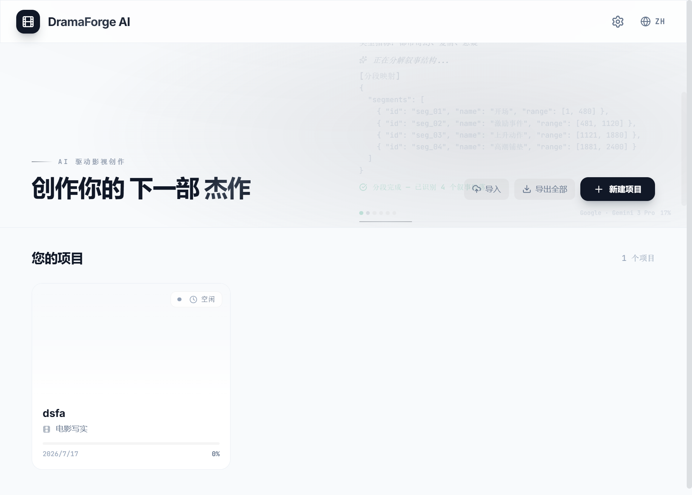
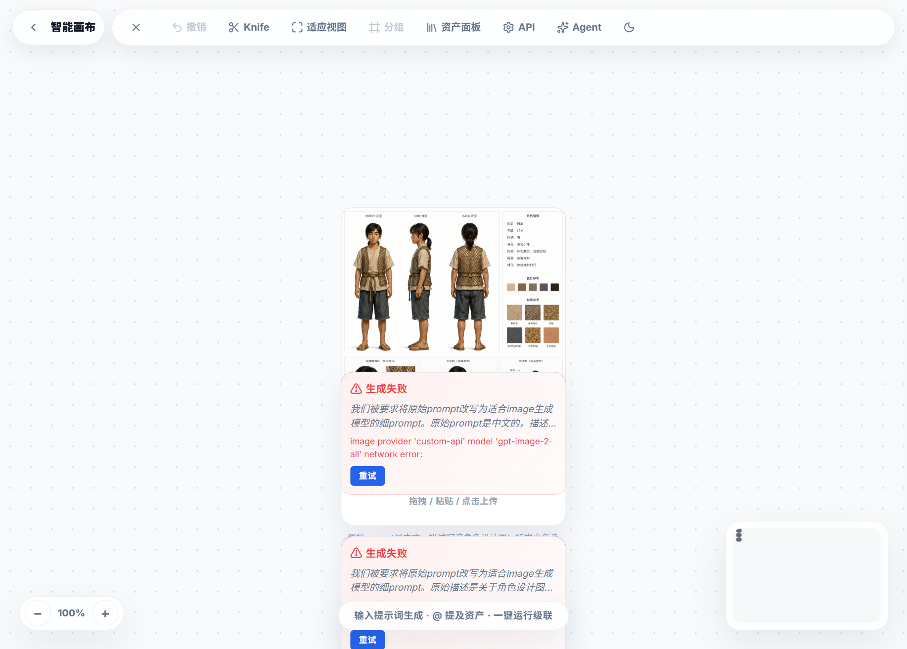
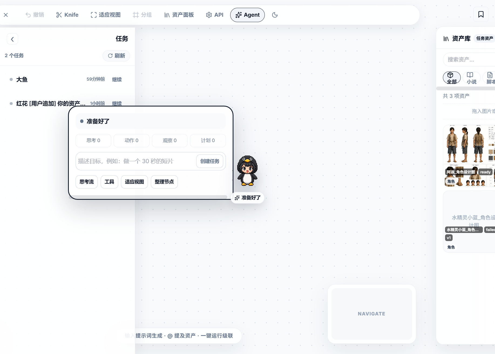
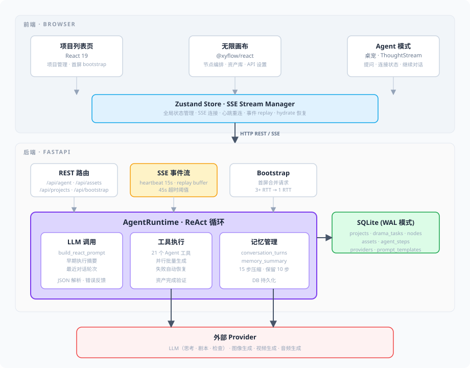
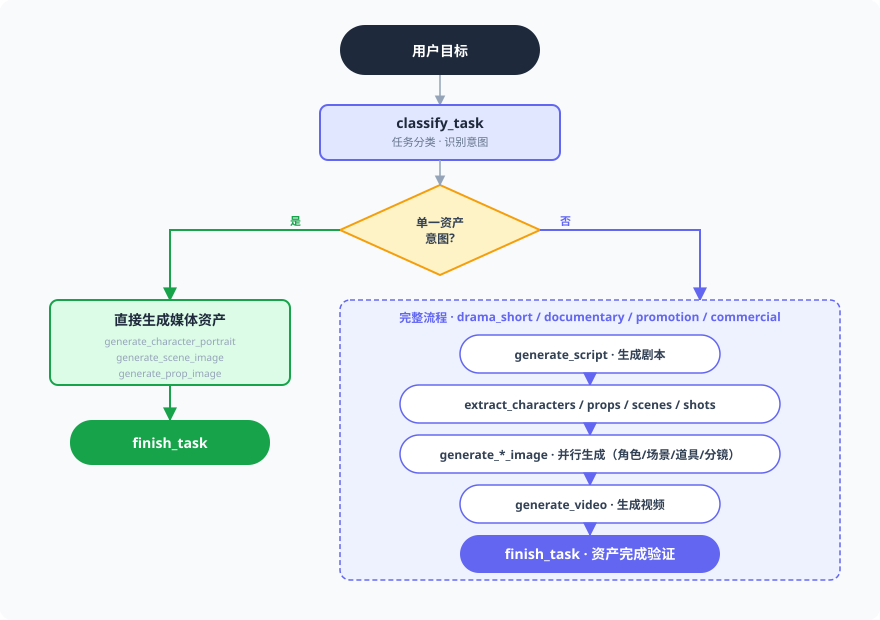

# DramaForge AI

<p align="center">
  
</p>

> 面向短剧创作的 AI Agent 工作台 —— 基于 ReAct 循环与 LLM 工具链，从一句话灵感到可交付的剧本、分镜、角色、场景、视频全链路自动编排。

DramaForge AI 不是一个传统的表单式生成器。它把一个拥有 20 年经验的"导演 Agent"放进你的画布里：你只需描述目标，Agent 会自主思考、规划、提问、并行生成媒体资产，并在失败时自动恢复。整个过程通过可拖动的桌宠面板和 ThoughtStream 实时呈现。

---

## 目录

- [截图速览](#截图速览)
- [核心特性](#核心特性)
- [系统架构](#系统架构)
- [技术栈](#技术栈)
- [快速开始](#快速开始)
- [Agent 工具链](#agent-工具链)
- [任务分类与流程](#任务分类与流程)
- [能力配置](#能力配置)
- [项目结构](#项目结构)
- [测试与构建](#测试与构建)
- [设计文档](#设计文档)

---

## 截图速览

### 首页 · 项目列表



打开 DramaForge 就是你的项目列表。每个项目拥有独立的资产库和画布，刷新或切换项目不会串数据。

### 无限画布 · 资产编排



画布是核心工作区。上传的图片、Agent 生成的角色/场景/道具/分镜/视频都以节点形式展示，支持拖拽布局、缩放、连线引用。左侧资产库面板可随时复用已有资产。

### Agent 模式 · 桌宠驱动



点击画布上的 Agent 按钮进入 Agent 模式。一只企鹅桌宠浮在画布上，自带可拖动面板：
- **状态栏**：实时显示 Agent 状态（思考中 / 等你回复 / 任务完成）
- **思考流**：Agent 的每一步 thought / action / observation
- **提问卡片**：Agent 需要你做决策时弹出，支持选项选择和自由文本
- **连接状态横幅**：SSE 断线时显示重连进度，支持手动重连
- **继续对话**：任务完成后可直接追加需求，Agent 记忆上下文继续工作

---

## 核心特性

### ReAct Agent 引擎

- **思考-行动-观察循环**：Agent 在每一步先思考（thought），再调用工具（action），观察结果（observation），循环推进直到任务完成
- **自动规划**：Agent 收到目标后自动拆解为 5-10 步可执行计划
- **智能提问**：遇到关键决策点（选题方向、风格选择、高成本操作确认）主动向用户提问
- **失败恢复**：工具调用失败时自动重试，超过阈值后进入有界恢复流程，单点失败不影响其他资产

### 资产智能

```text
上传资产 → 持久化到项目 → 多模态检查 → 必要时标准化 → 生成时按 ID 引用 → 跨镜头复用
```

- **多模态检查**：上传角色照片后，Agent 用视觉 LLM 检查是否符合项目角色标准
- **角色标准化**：不符合标准的照片自动创建带 `source_asset_id` 的标准化衍生资产
- **参考图引用**：图片/视频工具接收 `reference_asset_ids`，服务端解析项目内 URL，优先使用标准化衍生资产
- **并行生成**：多个互相独立的图片/视频任务通过批量工具并行执行，每个任务先创建 pending 节点

### 非线性任务支持

不只是"短剧全流程"。Agent 能识别单一资产生成意图：
- "给我画一个赛博朋克女主角角色图" → 直接调用 `generate_character_portrait`，不需要先生成脚本
- "生成一个古风场景概念图" → 直接调用 `generate_scene_image`
- 支持 `drama_short` / `documentary` / `promotion` / `commercial` / `custom` / `single_asset` 多种任务类型

### 多轮对话记忆

- 任务完成后支持继续对话，Agent 保留完整上下文
- 超过 15 步时自动压缩早期对话，保留最近 10 步，用 LLM 生成摘要注入 prompt
- 对话记忆持久化到数据库（`conversation_turns` + `memory_summary`），刷新不丢失

### 实时连接保障

- **SSE 流式推送**：Agent 的每一步思考、动作、观察通过 Server-Sent Events 实时推送到前端
- **心跳机制**：15s 心跳间隔 + 45s 超时阈值，PAUSED 状态下保持连接不断开
- **断线感知**：连接状态同步到全局 store，桌宠面板显示横幅，支持手动重连
- **检查点恢复**：退出 Agent 模式后重新进入，完整恢复 thoughts / actions / observations 历史

---

## 系统架构



---

## 技术栈

### 前端

| 技术 | 版本 | 用途 |
|------|------|------|
| [React](https://react.dev) | 19.2 | UI 框架 |
| [Vite](https://vitejs.dev) | 6.2 | 构建工具与开发服务器 |
| [Zustand](https://github.com/pmndrs/zustand) | 5.0 | 全局状态管理 |
| [@xyflow/react](https://xyflow.com) | 12.10 | 无限画布与节点系统 |
| [Framer Motion](https://www.framer.com/motion/) | 12.40 | 动画 |
| [Lucide React](https://lucide.dev) | 0.563 | 图标 |
| [TypeScript](https://www.typescriptlang.org) | 5.8 | 类型安全 |
| [Vitest](https://vitest.dev) | 2.1 | 单元/组件测试 |

### 后端

| 技术 | 版本 | 用途 |
|------|------|------|
| [FastAPI](https://fastapi.tiangolo.com) | 0.115+ | Web 框架 |
| [Uvicorn](https://www.uvicorn.org) | 0.30+ | ASGI 服务器 |
| [SQLAlchemy](https://www.sqlalchemy.org) | 2.0+ | ORM |
| [Pydantic](https://docs.pydantic.dev) | 2.7+ | 数据校验 |
| SQLite (WAL) | — | 嵌入式数据库 |

---

## 快速开始

### 环境要求

- Node.js >= 18
- Python >= 3.11
- uv（推荐）或 pip

### 前端

```bash
npm install
npm run dev
```

默认运行在 `http://localhost:5173`。

### 后端

```bash
cd backend
uv sync          # 或 pip install -r requirements.txt
uv run uvicorn app:app --reload --port 8765
```

健康检查：<http://127.0.0.1:8765/api/health>

### 配置 Provider

1. 打开前端，进入任意项目的画布
2. 点击画布右上角的设置图标
3. 在 API 设置中绑定三类能力：
   - **LLM**：支持文本生成和（可选）图片输入的模型，用于 Agent 思考和资产检查
   - **Image**：图片生成模型，用于角色/场景/道具/分镜图
   - **Video**：视频生成模型，用于最终视频产出

Agent 与画布共用这套配置，不使用隐藏的旧步骤模型或测试模型回退。如果缺少绑定，系统会在 ThoughtStream 中明确提示。

---

## Agent 工具链

Agent 拥有 21 个工具，覆盖从文本理解到媒体生成的完整链路：

### 规划与交互

| 工具 | 说明 |
|------|------|
| `parse_user_goal` | 解析用户目标，提取任务类型、交付物、输入来源 |
| `create_plan` | 将目标拆解为 5-10 步可执行计划 |
| `ask_user` | 向用户提问，支持选项选择和自由文本 |

### 文本生成（LLM）

| 工具 | 说明 |
|------|------|
| `generate_script` | 根据目标生成短剧剧本 |
| `extract_characters` | 从剧本中提取角色列表 |
| `extract_props` | 从剧本中提取道具列表 |
| `extract_scenes` | 从剧本中提取场景列表 |
| `extract_shots` | 从剧本中提取分镜列表 |
| `optimize_prompt` | 优化生成提示词 |

### 图片生成

| 工具 | 说明 |
|------|------|
| `generate_character_portrait` | 生成角色三视图（4-view character sheet） |
| `generate_prop_image` | 生成道具图 |
| `generate_scene_image` | 生成场景概念图 |
| `generate_storyboard_image` | 生成分镜草图 |

### 视频与音频

| 工具 | 说明 |
|------|------|
| `generate_video` | 根据提示词和参考图生成视频 |
| `generate_voiceover` | 生成配音 |
| `generate_bgm` | 生成背景音乐 |

### 资产管理与批量

| 工具 | 说明 |
|------|------|
| `generate_media_batch` | 并行批量生成多个媒体资产 |
| `save_asset` | 保存生成结果为项目资产 |
| `get_artifacts` | 获取当前任务已生成的资产列表 |
| `inspect_asset` | 多模态检查上传资产 |
| `prepare_character_asset` | 角色标准化（创建衍生资产） |

---

## 任务分类与流程

Agent 根据 `parse_user_goal` 的结果自动选择流程：



### 任务类型

| 类型 | 说明 | 交付物 |
|------|------|--------|
| `drama_short` | 短剧 | script, storyboard, video, character, scene, prop |
| `documentary` | 纪录片 | script, storyboard, video |
| `promotion` | 推广内容 | promotional_video, storyboard |
| `commercial` | 广告 | script, storyboard, video |
| `custom` | 自定义 | 用户指定的交付物 |
| `single_asset` | 单一资产 | character / scene / prop / storyboard（仅一项） |

---

## 能力配置

API 设置只绑定三类能力：`llm`、`image`、`video`。

- **LLM 能力**：Agent 思考、剧本生成、资产检查、提示词优化都走这里。如果需要多模态检查（上传图片识别），需绑定支持图片输入的 LLM。
- **Image 能力**：角色图、场景图、道具图、分镜图的生成。provider 是否支持参考图影响可用的引用路径。
- **Video 能力**：最终视频生成。

缺少绑定时系统会在 ThoughtStream 中明确提示，不会静默使用旧配置。

---

## 项目结构

```text
dramaforge-ai/
├── agent/                         # Agent 前端模块
│   ├── agent-mode.tsx             #   Agent 模式入口
│   ├── agent-pet-controller.tsx   #   桌宠控制器（拖动、面板、状态）
│   ├── agent-stream-manager.ts    #   SSE 连接管理（心跳、重连、replay）
│   ├── ask-user-response.tsx      #   提问组件（选项 + 自由文本）
│   ├── thought-stream.tsx         #   思考流面板
│   ├── use-agent-store.ts         #   Zustand store（状态、事件、hydrate）
│   ├── task-list.tsx              #   任务列表面板
│   └── agent.css                  #   Agent 模式样式
├── components/
│   └── infinite-canvas/           # 无限画布组件（节点、边、API 设置）
├── services/
│   └── apiClient.ts              # 前端 API client（REST + SSE）
├── backend/
│   └── app/
│       ├── agent/
│       │   ├── runtime.py         #   AgentRuntime — ReAct 循环核心
│       │   ├── llm.py             #   LLM 调用 + build_react_prompt
│       │   ├── memory.py          #   AgentMemory — 对话记忆与压缩
│       │   ├── task_profiles.py   #   任务分类与 TaskProfile
│       │   ├── media_assets.py    #   媒体资产生命周期管理
│       │   ├── events.py          #   SSE 事件类型定义
│       │   └── tools/             #   21 个 Agent 工具
│       │       ├── planning.py    #     parse_user_goal, create_plan, ask_user
│       │       ├── llm_tools.py   #     generate_script, extract_*, optimize_prompt
│       │       ├── image_tools.py #     generate_character/prop/scene/storyboard
│       │       ├── video_tools.py #     generate_video
│       │       ├── audio_tools.py #     generate_voiceover, generate_bgm
│       │       ├── media_batch.py #     generate_media_batch（并行）
│       │       └── asset_tools.py #     save_asset, get_artifacts
│       ├── routers/               # FastAPI 路由
│       │   ├── agent.py           #   /api/agent/* — 任务 CRUD + SSE
│       │   ├── assets.py          #   /api/assets/* — 资产管理
│       │   ├── bootstrap.py       #   /api/bootstrap — 首屏合并请求
│       │   ├── projects.py        #   /api/projects/*
│       │   └── ...
│       ├── models.py              # SQLAlchemy 模型
│       ├── schemas.py             # Pydantic schema
│       └── database.py            # SQLite + WAL 模式
├── docs/                          # 设计文档与截图
│   └── screenshots/               #   界面截图
├── public/
│   └── agent/
│       └── agent-pet-penguin.png  #   桌宠形象
├── tests/                         # 前端测试
└── backend/tests/                 # 后端测试
```

---

## 测试与构建

### 前端

```bash
# 单元/组件测试
npm test

# 生产构建
npm run build
```

### 后端

```bash
cd backend
uv run pytest -q
```

### 测试覆盖重点

- **资产工作流**：上传持久化、项目隔离、多模态检查、角色标准化、参考资产解析、重复生成保护
- **Agent 运行时**：ReAct 循环、任务分类、source gate、失败恢复、记忆压缩
- **SSE 连接**：心跳间隔、replay buffer、断线重连
- **前端交互**：桌宠拖动、提问组件锁定、连接状态横幅、检查点恢复

---

## 设计文档

设计文档位于 `docs/` 目录，涵盖：

- Agent 多域资产编排设计与实施计划
- 全资产大师 V3.0 场景+角色+道具万能版规范
- 视频提示词模板
- 分镜解析规范

---

## License

Private
